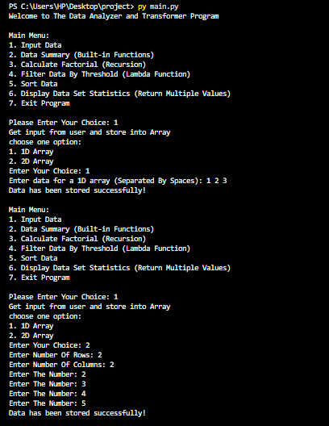

# Data Analyzer & Transformer

## Project Description
The Data Analyzer & Transformer is a menu-driven Python project that allows users to input, analyze, filter, sort, and transform numerical data using different Python concepts.

## Output Image

## Features

### 1. Input Data
- Input 1D Array
- Input 2D Array
- Store numerical data entered by the user

### 2. Display Data Summary
- Calculate total number of elements
- Find minimum value
- Find maximum value
- Calculate sum of all values
- Calculate average of data

### 3. Calculate Factorial
- Calculate factorial of a given number
- Uses Recursion concept

### 4. Filter Data by Threshold
- Filter values greater than the given threshold
- Uses Filter and Lambda functions

### 5. Sorting Data
- Sort data in Ascending Order
- Sort data in Descending Order

### 6. Dataset Statistics
- Find minimum value
- Find maximum value
- Calculate total sum
- Calculate average
- Return multiple values from a function

## Technologies Used
- Python 3
- VS Code

## Concepts Used
- Functions
- Lists
- Nested Lists
- Conditional Statements
- For Loop
- While Loop
- Recursion
- Lambda Function
- Filter Function
- Built-in Functions
- Sorting
- Return Multiple Values

## How to Run
1. Clone or download the repository.
2. Open the project in VS Code.
3. Run the Python file.
4. Select an option from the main menu.

## Main Menu
1. Input Data
2. Display Data Summary
3. Calculate Factorial
4. Filter Data by Threshold
5. Sort Data
6. Display Dataset Statistics
7. Exit Program

## Conclusion
This project helps in understanding Python programming concepts through practical implementation of data analysis and transformation operations.